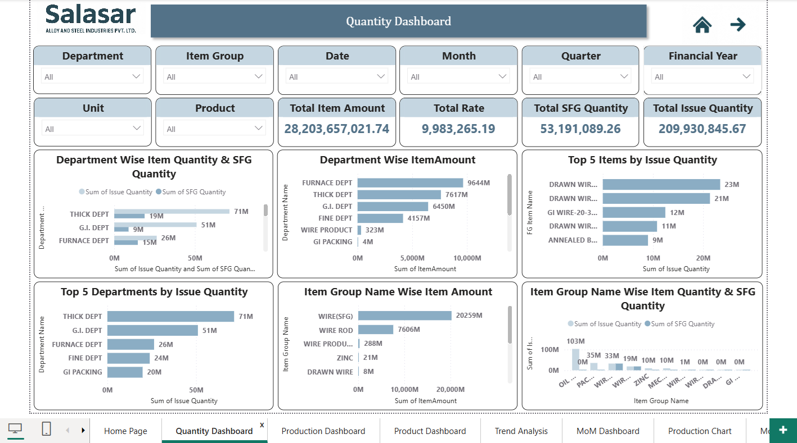

# **Manufacturing Production and Inventory Analytics Dashboard Using Power BI**

## **Project Overview**

This project focuses on analyzing manufacturing production data using Power BI. The dashboard provides insights into raw material usage, finished goods production, inventory levels, and department-wise performance. It helps visualize production quantity and trends to support better operational and production decisions.

## **Dashboard Preview**

## **Dataset Information**

The dataset used in this project is an Excel file containing manufacturing production data. It includes details such as production date, department name, finished goods, raw materials issued, quantity utilized, item groups, rates, and production cost. This data is used to analyze production performance, material usage, and inventory trends in the dashboard.

## **Tools & Technologies used**

- Power BI
- Power Query Editor (Data Cleaning & Transformation)
- DAX (Calculated Measures & KPIs)
- Microsoft Excel (Data Source)

## **Key Insights**

- Identified products with the highest production quantity using the Product Dashboard.
- Analyzed department-wise production to understand which departments contribute most to manufacturing output.
- Examined raw material usage by comparing item groups and quantity utilized.
- Tracked weekly and monthly production trends to observe changes in manufacturing activity.
- Compared production quantity and costs to understand overall resource utilization.
